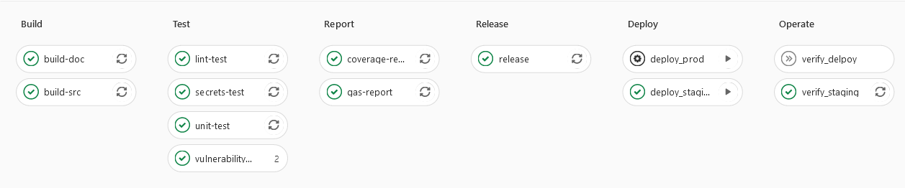

# Smart Contract DevOps

This repository contains a Solidity sample project that builds on [hardhat](https://github.com/nomiclabs/hardhat) as a development environment and demonstrates a DevOps approach with Continuous Integration/Continuous Delivery using Gitlab CI.

## Tool Setup

- [eslint](https://eslint.org/): A linting utility for JS code
- [ethers.js](https://github.com/ethers-io/ethers.js/): General purpose Ethereum library and wallet implementation 
- [hardhat-abi-exporter](https://hardhat.org/plugins/hardhat-abi-exporter.html): Exports generated ABIs on compilation
- [hardhat-contract-sizer](https://hardhat.org/plugins/hardhat-contract-sizer.html): Outputs Solidity contract sizes on compilation
- [hardhat-deploy](https://hardhat.org/plugins/hardhat-deploy.html): Plugin for replicable deployments and easy testing
- [hardhat-docgen](https://hardhat.org/plugins/hardhat-docgen.html): Generates documentation from NatSpec comments
- [hardhat-gas-reporter](https://hardhat.org/plugins/hardhat-gas-reporter.html): Generates gas reports
- [hardhat-watcher](https://hardhat.org/plugins/hardhat-watcher.html): Optionally run actions when files change (e.g., auto compile)
- [husky](https://github.com/typicode/husky): Modern native git hooks (used to setup pre-commit tasks)
- [prettier](https://prettier.io/): An opinionated code formatter that supports many languages
- [prettier-plugin-solidity](https://github.com/prettier-solidity/prettier-plugin-solidity): Formatter for Solidity
- [semantic-release](https://github.com/semantic-release/semantic-release): Version management/package publishing based on commit [prefixes](https://github.com/angular/angular.js/blob/master/DEVELOPERS.md#type)
- [slither](https://github.com/crytic/slither): Static analysis framework used to inspect Solidity smart contracts
- [solidity-coverage](https://github.com/sc-forks/solidity-coverage): Determines code coverage for Solidity testing
- [solhint](https://github.com/protofire/solhint): A linting utility for Solidity code
- [trufflehog3](https://github.com/feeltheajf/trufflehog3): A secret scanner that searches through git repositories for secrets
- [waffle](https://github.com/EthWorks/Waffle): Tooling for writing smart contract tests

## Usage

### Prerequisites

`Node.js` and `npm` are required. The following versions were used:

- `Node.js` – v16.7.0
- `npm` – 7.20.3

### Installation

Run `npm install` to install above tools (all dependencies specified in `package.json`) and prepare husky (pre-commit) hooks.

### Configuration

- `hardhat.config.js`: The file contains the configuration for setting up the development environment and the blockchain connection. For more information read [hardhat configuration](https://hardhat.org/config/).
- `.env` (_Needs to be created manually_): For development an `.env` file containing several environment variables must exist in the root directory of the project. The provided `.env.example` file serves as a template. At the moment the most important entries are the following:
  - `INFURA_API_KEY`: The project does not use its own Ethereum node, so an external provider, Infura, is used. To get the key visit the [infura website](https://infura.io/).
  - `MNEMONIC`= Mnemonic phrase of the HD wallet used for interacting with the networks (i.e. private key). Contracts are provisioned from an account (derived from the mnemonic) which should have enough funds to provision the contracts.
  - `ETHERSCAN_API_KEY`: Block explorer key needed for contract verification.
  - `COINMARKETCAP_API_KEY`: Crypto data provider used to fetch exchange rates for gas fee calcualtion in gas reports.
- In addition, there are several configuration files for the above tools in the project root. For more details, please refer to the respective documentation.

### General Project Structure

- The standard `package.json` file with several helpful script commands
- `.husky` folder contains pre-commit hooks configuration
- `contracts` folder contains Solidity files
- `deploy` folder contains deployment scripts for hardhat-deploy
- `scripts` folder contains useful general purpose scripts for development
- `tasks` folder contains custom hardhat tasks
- `test` folder contains mocha test files
- `utils` folder contains helpful dev scripts
- The projet `root` contains configuration files
- When running tasks additional folders containing generated artifacts are created (e.g., abi, artifacts, docs, etc.)

### Commands

The standard package.json file contains several helpful script commands:

- npm run lint:[ sol | js ]  -  Lint the Solidity/JS code  
- npm run lint:js   -  Lint the JS code  
- npm run compile   - Compile smart contracts with hardhat  
- npm run test      - Run mocha tests under /test folder  
- npm run docgen    - Generate docs  
- npm run coverage  - Generate code coverage configured by .solcover.js  
- npm run gas-report - Generates a gas-report 
- npm run slither   - Static analysis of smart contracts with slither  
- npm run mythril   - Static analysis of smart contracts with mythril  
- npm run clean     - Delete build artifacts  
- npm run deploy:staging - Deploy smart contracts to ropsten/mainnet  
- npm run verify:[ staging | production ] - Verify smart contracts for ropsten/mainnet

## DevOps (CI/CD) using Gitlab CI

The Gitlab CI pipeline configured with `.gitlab-ci.yml` automates several of the above mentioned tasks and is triggered on each commit to the main branch.
The project is configured with a pre-commit hook to ensure that source files pass linting before a commit can take place.

### Setup

The env variables must be provisioned to the pipeline through Settings>CI/CD>Variables. In addition a `GITLAB_TOKEN` secret (masked) access-token variable with api and write permission must be provided. This token can be generated by navigating to Project>Settings>Access Tokens.  

### Stages

The pipeline contains the following stages:  
Build > Test > Report > Release > Deploy > Operate

 

#### Build
The build step compiles sources and includes ABI and documentation generation.

#### Test
The test step runs lint, unit and vulnerability analysis test jobs and scans the repo for accidentally committed secrets.

#### Report
The report step generates test coverage and gas reports.

#### Release
The release step allows versioning (major/minor/patch) based on commit [prefixes](https://github.com/angular/angular.js/blob/master/DEVELOPERS.md#type). As part of publishing a package, semantic-release bumps the version in package.json. Further, it automates the publishing of NPM packages to GitLab's Package Registry and auto-generates releases on the Releases page.

#### Deploy
The deploy step deploys smart contracts, deployment results are synced back to the repo (within the deployments folder).

#### Operate
The operate step verifies deployed smart contracts through Etherscan.

## Improvement Roadmap

- It might be useful to setup a pre-commit hook to check that commit messages are valid in regards to semantic versioning.
- The CI/CD pipeline could be optimized to run several tasks in parallel, not waiting on the outcome of previous steps (e.g., lint-test does not need to wait for build step).
- Vulnerability tests run against contracts folder containing Solidity files which may contain hardhat proprietary console.log statements. This leads to issues during vulnerability tests.
  With `npx hardhat preprocess --network mainnet --dest contracts_preprocessed` sources can be preprocessed. It would be better to instrument vulnerability tests on preprocessed sources.
- Use TypeScript for static typing and employ [TypeChain](https://github.com/ethereum-ts/TypeChain) to use TypeScript bindings for Ethereum smart contracts.

